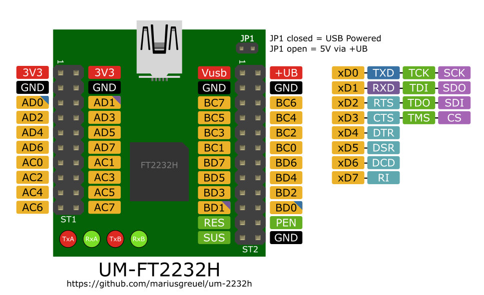

# UM-FT2232H Pinout

Here is the pinout of the FTDI FT2232H module [UM-FT2232H](https://de.elv.com/elv-highspeed-mini-usb-modul-um-ft2232h-komplettbausatz-099347)
distributed by [ELV Germany](https://de.elv.com/):



The pinout is available in various formats:

- [UM-FT2232H.pdf](./UM-FT2232H.pdf)
- [UM-FT2232H.png](./UM-FT2232H.png)
- [UM-FT2232H.svg](./UM-FT2232H.svg)

## Pinout Connector ST1 and ST2

### ST1

```plain
       3V3 -  1    2 - 3V3
       GND -  3    4 - GND
   TXD AD0 -  5    6 - AD1 RXD
   RTS AD2 -  7    8 - AD3 CTS
   DTR AD4 -  9   10 - AD5 DSR
   DCD AD6 - 11   12 - AD7 RI
       AC0 - 13   14 - AC1
       AC2 - 15   16 - AC3 Rx LED
Tx LED AC4 - 17   18 - AC5
       AC6 - 19   20 - AC7
```

### ST2

```plain
     +Uusb -  1    2 - +UB
       GND -  3    4 - GND
       BC7 -  5    6 - BC6
       BC5 -  7    8 - BC4 Tx LED
Rx LED BC3 -  9   10 - BC2
       BC1 - 11   12 - BC0
    RI BD7 - 13   14 - BD6 DCD
   DSR BD5 - 15   16 - BD4 DTR
   CTS BD3 - 17   18 - BD2 RTS
   RXD BD1 - 19   20 - BD0 TXD
    /RESET - 21   22 - /PWREN
    /SUSPD - 23   24 - GND
```

## License

UM-FT2232H Pinout (c) 2022 by Marius Greuel is licensed under CC BY-SA 4.0.
